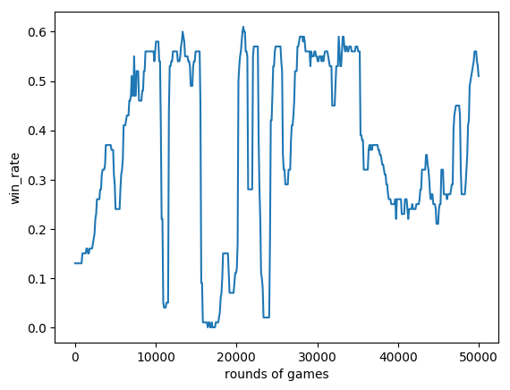

# Game Description 
You and your opponent each have 10 (`action_size-1`) bargaining chips, and you will play 5 (`state_size`) matches to compare your bets. The person with the most wins will ultimately be declared the winner.

Play the game here: [betting game](shawnhsueh.pythonanywhere.com)

Here is an example of the game:
* Match 1: your bet is 3 and opponen's bet is 2. You win.
* Match 2: your bet is 0 and opponen's bet is 2. You lose.
* Match 3: your bet is 4 and opponen's bet is 4. The game is tied.
* Match 4: your bet is 2 and opponen's bet is 1. You win.
* Match 5: your bet is 1 and opponen's bet is 1. The game is tied.

Since you won 2 matches and your opponent won only 1, you have ultimately won the game. This Big Small Game environment is written in`BSG.py`.

# Model
The model was written in `dqn.py`

Reinforcement learning was employed to train the model, which initially had no knowledge of the game's rules. The deep Q-network in Keras was used for training. During each match, the model's output for a bet larger than the remaining chips was assigned a value of -1. The winner of the game received a reward of 1, while the loser received a reward of -1. As the reward is sparse and only given at the end of the game, the Temporal-Difference method was used to assign the reward to the prior decision that led to the win. The Epsilon-Greedy Exploration with decreasing epsilon was used to encourage random decision at early game.

# Model input/output
Model input: A list of four integers that store `[my remaining chips, opponent's remaining chips, my wins, opponent's wins, number of finished matches]`

Model output: A list of `n_action` (ex. 11) real numbers, that represent the reward of playing the corresponding index in the next game.

# Model training
The training are composed of two processes.

* `trainer_self.py`: the model learned the rules and developed strategies for winning throug self-play. The self-play was repeated 50000 times. 
* `trainer_rand.py`: the model was playing against a random-bet agent `randseq.py` that randomly separates  bargaining chips into 5 portions. The game was repeated 50000 times.

# Model performance
An AI was trained to play a 5-round game with 10 bargaining chips. It can eventaully out-perform the random-bet agent, achieving a win rate greater than 50%. The plot below illustrates the win rate's progression during the training process. The fluctuations in the plot can be attributed to the utilization of a relatively small `batch_size = 5`.

